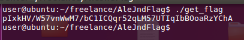
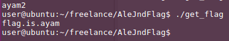

AleJndFlag
==========

`AleJndFlag` is a "flag puller" used to get the flag from the scoreboard server. The flag returns is differ based on the entrypoints used by the attacker.

Single flag mode:



Multi flag mode:



#### Usage

Install the dependencies

*NOTE* : Make sure to set the `INTERFACE` in file `get_flag.cpp` to the configured interface name.

```Bash
$ sudo apt-get install libjsoncpp-dev libcurl4-openssl-dev libssl-dev
$ make single - for single flag mode
$ ./get_flag
```

For multi flag mode, make sure to define the vulnerable service SUID inside the `service_info` structure in `include/services.h`.

```C++
struct services_info service[] =
{
    {1000},
    {1001}
};
```

Then update the `FLAGSUBMIT_URL` in `get_flag.cpp`.